## Part 1. Установка ОС ##
* 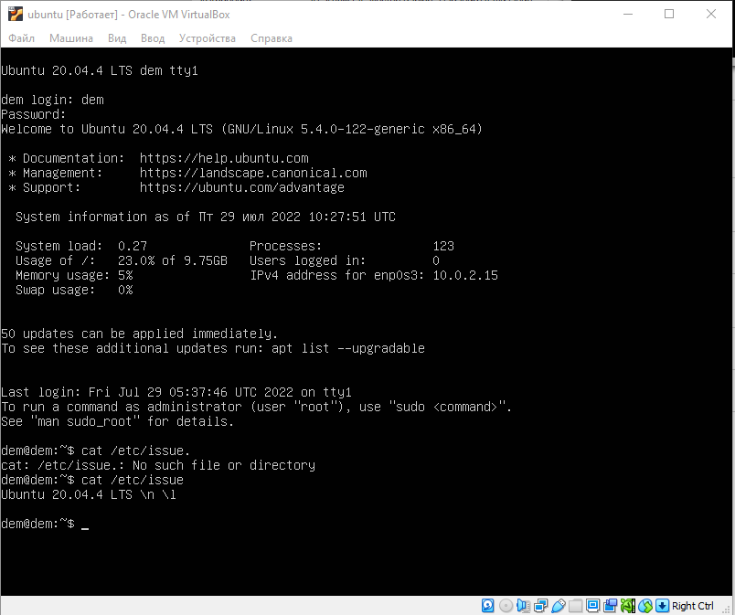
> Вывод команды cat /etc/issue
## Part 2. Создание пользователя ##
* 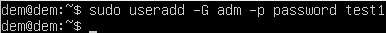 
>Cкриншот вызова команды для создания пользователя
* 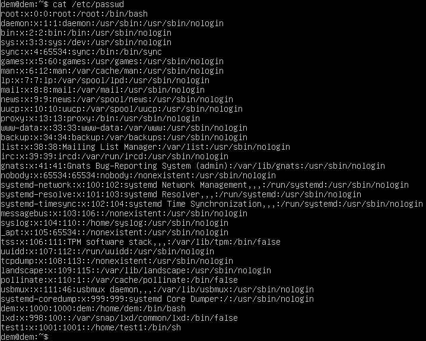
>  скриншот с выводом команды cat /etc/passwd
## Part 3. Настройка сети ОС ##
* Задать название машины вида user-1
> Изменить старое имя на новое в обоих файлах.
>sudo nano /etc/hostname
>sudo nano /etc/hosts
* Установить временную зону, соответствующую вашему текущему местоположению.
>sudo timedatectl set-timezone Europe/Moscow
* Вывести названия сетевых интерфейсов с помощью консольной команды.
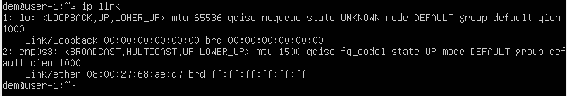
>lo - loopback interface сетевой интерфейс, с помощью которого можно передавать информацию на машину отправителя. Используется для тестирования.
* Используя консольную команду получить ip адрес устройства, на котором вы работаете, от DHCP сервера
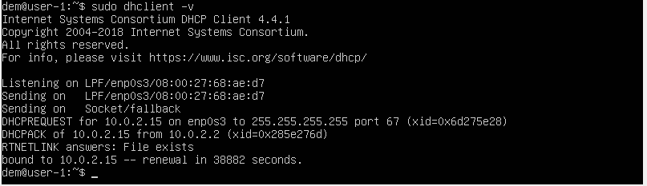
> Dynamic Host Configuration Protocol (DHCP) — автоматический предоставляет IP адреса и прочие настройки сети (маску сети, шлюз и т.п) компьютерам и различным устройствам в сети.
* Определить и вывести на экран внешний ip-адрес шлюза (ip) и внутренний IP-адрес шлюза, он же ip-адрес по умолчанию (gw)
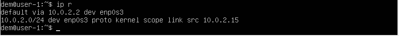
* Задать статичные (заданные вручную, а не полученные от DHCP сервера) настройки ip, gw, dns (использовать публичный DNS серверы, например 1.1.1.1 или 8.8.8.8).
Добавить в /etc/dhcp/dhclient.conf 
interface "enp0s3" {
    send dhcp-requested-address 10.0.2.4;
    send dhcp-requested-gw 10.0.2.3;
    send dhcp-requested-dns 8.8.8.8;
}
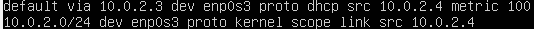
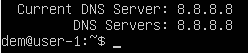
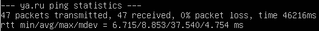
## Part 4. Обновление ОС ##
* Обновить системные пакеты до последней на момент выполнения задания версии.
> sudo apt-get update
> sudo apt-get upgrade
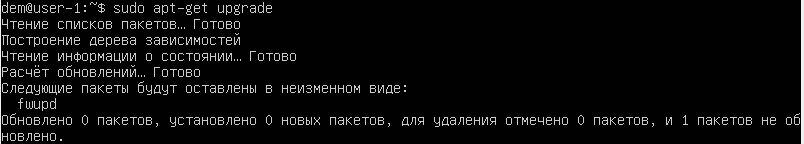
## Part 5. Использование команды sudo ##
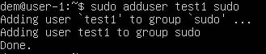
> Команда sudo предоставляет возможность пользователям выполнять команды от имени суперпользователя root, либо других пользователей
* Поменять hostname ОС от имени пользователя, созданного в пункте Part 2 (используя sudo).

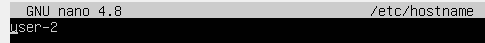
## Part 6. Установка и настройка службы времени ##
* Настроить службу автоматической синхронизации времени.
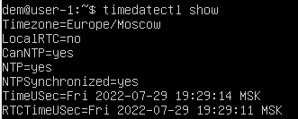
## Part 7. Установка и использование текстовых редакторов ##
* Используя каждый из трех выбранных редакторов, создайте файл test_X.txt, где X -- название редактора, в котором создан файл. Напишите в нём свой никнейм, закройте файл с сохранением изменений
VIM

>:qw для выхода с сохранением

nano
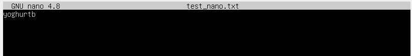
>ctrl+x + Y для выхода с сохранением

mcedit
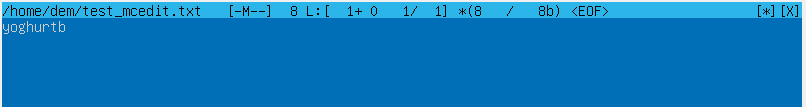
>f2 f10 для выхода с сохранением

*Используя каждый из трех выбранных редакторов, откройте файл на редактирование, отредактируйте файл, заменив никнейм на строку "21 School 21", закройте файл без сохранения изменений.

VIM
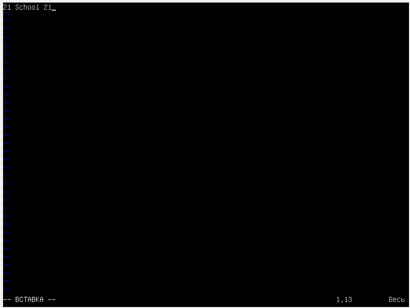
>:q! для выхода

nano
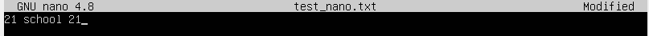
>ctrl+x + N для выхода

mcedit
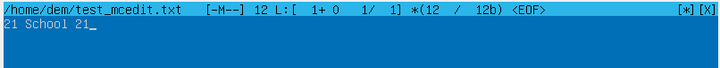
>f10 для выхода

*Используя каждый из трех выбранных редакторов, отредактируйте файл ещё раз (по аналогии с предыдущим пунктом), а затем освойте функции поиска по содержимому файла (слово) и замены слова на любое другое.

VIM

>:s/yoghurtb/hello/g

nano
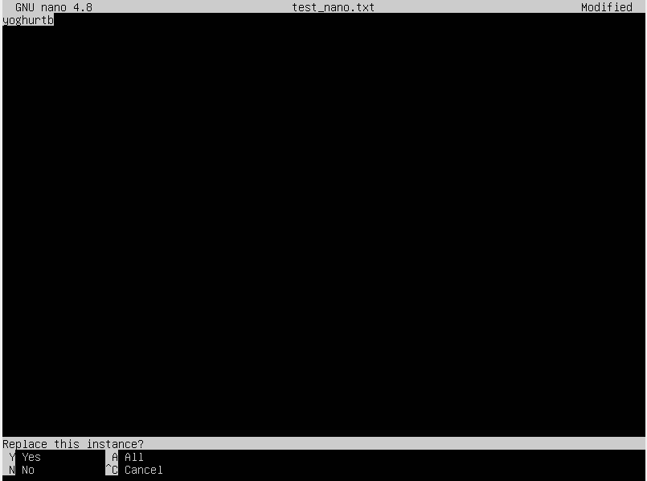
>ctrl+\ 

mcedit
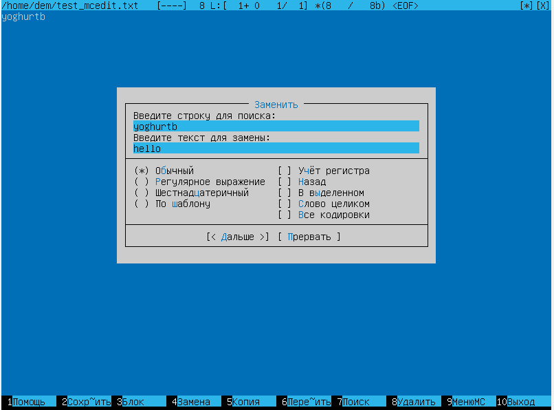
>f4
## Part 8. Установка и базовая настройка сервиса SSHD ##

*Установить службу SSHd.

>sudo apt install openssh-server

*Добавить автостарт службы при загрузке системы.

>sudo systemctl start sshd

*Перенастроить службу SSHd на порт 2022.

>Добавить порт в sudo nano /etc/ssh/ssh_config

*Используя команду ps, показать наличие процесса sshd. Для этого к команде нужно подобрать ключи.

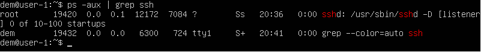
>Утилита ps выводит список процессов.
>-a - выбрать все процессы, кроме фоновых
>-u - выбрать процессы пользователя.
>-x показать процессы, не подключенные к терминалу

netstat -tan
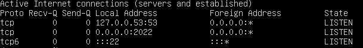
>-tan список соединений TCP с IP адресами.
1. Протокол соединения
2. данные в буфере приема TCP/IP
3. данные в буфере отправки TCP/IP
4. адрес и номер порта локального конца сокета
5. адрес и номер порта удаленного конца сокета
6. состояние сокета
0.0.0.0 - все адреса IPv4

## Part 9. Установка и использование утилит top, htop ##

  
  
