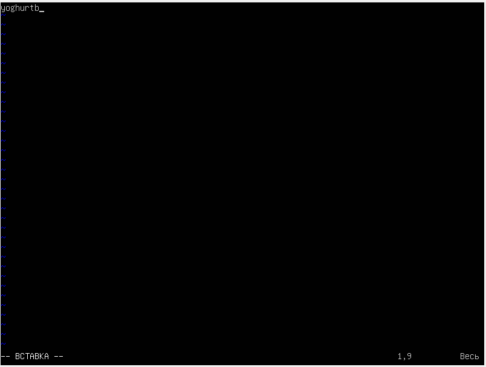

## Part 1. Установка ОС ##
*   
Вывод команды cat /etc/issue  
## Part 2. Создание пользователя ##
*   
Cкриншот вызова команды для создания пользователя  
*   
скриншот с выводом команды cat /etc/passwd  
## Part 3. Настройка сети ОС ##
* Задать название машины вида user-1  
Изменить старое имя на новое в обоих файлах.  
sudo nano /etc/hostname  
sudo nano /etc/hosts  
* Установить временную зону, соответствующую вашему текущему местоположению.  
sudo timedatectl set-timezone Europe/Moscow  
* Вывести названия сетевых интерфейсов с помощью консольной команды.  
  
lo - loopback interface сетевой интерфейс, с помощью которого можно передавать информацию на машину отправителя. Используется для тестирования.  
* Используя консольную команду получить ip адрес устройства, на котором вы работаете, от DHCP сервера  
  
Dynamic Host Configuration Protocol (DHCP) — автоматический предоставляет IP адреса и прочие настройки сети (маску сети, шлюз и т.п) компьютерам и различным устройствам в сети.  
* Определить и вывести на экран внешний ip-адрес шлюза (ip) и внутренний IP-адрес шлюза, он же ip-адрес по умолчанию (gw)  
  
* Задать статичные (заданные вручную, а не полученные от DHCP сервера) настройки ip, gw, dns (использовать публичный DNS серверы, например 1.1.1.1 или 8.8.8.8).  
Добавить в /etc/dhcp/dhclient.conf  
interface "enp0s3" {  
    send dhcp-requested-address 10.0.2.4;  
    send dhcp-requested-gw 10.0.2.3;  
    send dhcp-requested-dns 8.8.8.8;  
}  
  
  
  
## Part 4. Обновление ОС ##
* Обновить системные пакеты до последней на момент выполнения задания версии.  
sudo apt-get update  
sudo apt-get upgrade  
  
## Part 5. Использование команды sudo ##
  
Команда sudo предоставляет возможность пользователям выполнять команды от имени суперпользователя root, либо других пользователей  
* Поменять hostname ОС от имени пользователя, созданного в пункте Part 2 (используя sudo).  
  
  
## Part 6. Установка и настройка службы времени ##
* Настроить службу автоматической синхронизации времени.  

## Part 7. Установка и использование текстовых редакторов ##
* Используя каждый из трех выбранных редакторов, создайте файл test_X.txt, где X -- название редактора, в котором создан файл. Напишите в нём свой никнейм, закройте файл с сохранением изменений  
VIM  
  
>:qw для выхода с сохранением

nano  
  
>ctrl+x + Y для выхода с сохранением  

mcedit  
  
>f2 f10 для выхода с сохранением  

*Используя каждый из трех выбранных редакторов, откройте файл на редактирование, отредактируйте файл, заменив никнейм на строку "21 School 21", закройте файл без сохранения изменений.  

VIM

>:q! для выхода

nano  
  
>ctrl+x + N для выхода  
  
mcedit  
  
>f10 для выхода  

*Используя каждый из трех выбранных редакторов, отредактируйте файл ещё раз (по аналогии с предыдущим пунктом), а затем освойте функции поиска по содержимому файла (слово) и замены слова на любое другое.  

VIM  
  
>:s/yoghurtb/hello/g  

nano  
  
>ctrl+\  

mcedit  
  
>f4  
## Part 8. Установка и базовая настройка сервиса SSHD ##

*Установить службу SSHd.  

sudo apt install openssh-server  

*Добавить автостарт службы при загрузке системы.  

sudo systemctl start sshd  

*Перенастроить службу SSHd на порт 2022.  

Добавить порт в sudo nano /etc/ssh/sshd_config  

*Используя команду ps, показать наличие процесса sshd. Для этого к команде нужно подобрать ключи.  

  
Утилита ps выводит список процессов.  
-a - выбрать все процессы, кроме фоновых  
-u - выбрать процессы пользователя.  
-x показать процессы, не подключенные к терминалу  

netstat -tan  
  
-tan список соединений TCP с IP адресами.  
1. Протокол соединения  
2. данные в буфере приема TCP/IP  
3. данные в буфере отправки TCP/IP  
4. адрес и номер порта локального конца сокета  
5. адрес и номер порта удаленного конца сокета  
6. состояние сокета  
0.0.0.0 - все адреса IPv4  

## Part 9. Установка и использование утилит top, htop ##

* По выводу команды top определить и написать в отчёте:  
uptime - 1:02  
количество авторизованных пользователей - 1 user  
общую загрузку системы - 0.00, 0.00, 0.00  
общее количество процессов - 111  
загрузку cpu - 0,0  
загрузку памяти - 173,0 used  
pid процесса занимающего больше всего памяти - 365  
pid процесса, занимающего больше всего процессорного времени - 13  

* В отчёт вставить скрин с выводом команды htop:  
отсортированному по PID, PERCENT_CPU, PERCENT_MEM, TIME  
  
  
  
  
отфильтрованному для процесса sshd  
  
с процессом syslog, найденным, используя поиск  
  
с добавленным выводом hostname, clock и uptime  
  
## Part 10. Использование утилиты fdisk ##
* Запустить команду fdisk -l.  
В отчёте написать название жесткого диска, его размер и количество секторов, а также размер swap:  
/dev/sda, 20,63 GiB, 432285544 sectors, 0  
## Part 11. Использование утилиты df ##
*В отчёте написать для корневого раздела (/):  
размер раздела - 10218772  
размер занятого пространства - 2657988  
размер свободного пространства - 7020112  
процент использования - 28%  
Определить и написать в отчёт единицу измерения в выводе. - килобайт  

*Запустить команду df -Th.  
*В отчёте написать для корневого раздела (/):  
размер раздела - 9,8G  
размер занятого пространства - 2,6G  
размер свободного пространства - 6,7G  
процент использования - 28%
Определить и написать в отчёт тип файловой системы для раздела. - ext4  
## Part 12. Использование утилиты du ##
*Запустить команду du.  
  

Вывести размер папок /home, /var, /var/log (в байтах, в человекочитаемом виде)  
  

Вывести размер всего содержимого в /var/log (не общее, а каждого вложенного элемента, используя *)  
  
## Part 13. Установка и использование утилиты ncdu ##
*Вывести размер папок /home, /var, /var/log.
  
  
## Part 14. Работа с системными журналами ##
Написать в отчёте время последней успешной авторизации, имя пользователя и метод входа в систему.  
14:33:17, dem, login
Перезапустить службу SSHd.
Вставить в отчёт скрин с сообщением о рестарте службы (искать в логах).
  
## Part 15. Использование планировщика заданий CRON ##
* Используя планировщик заданий, запустите команду uptime через каждые 2 минуты.  
  
Найти в системных журналах строчки (минимум две в заданном временном диапазоне) о выполнении.  
  

Вывести на экран список текущих заданий для CRON.  
  

* Удалите все задания из планировщика заданий.  

В отчёт вставьте скрин со списком текущих заданий для CRON.  
  

  
  
